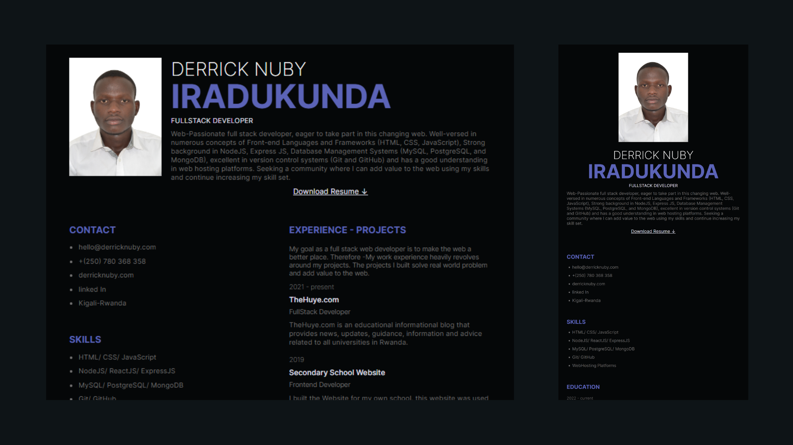
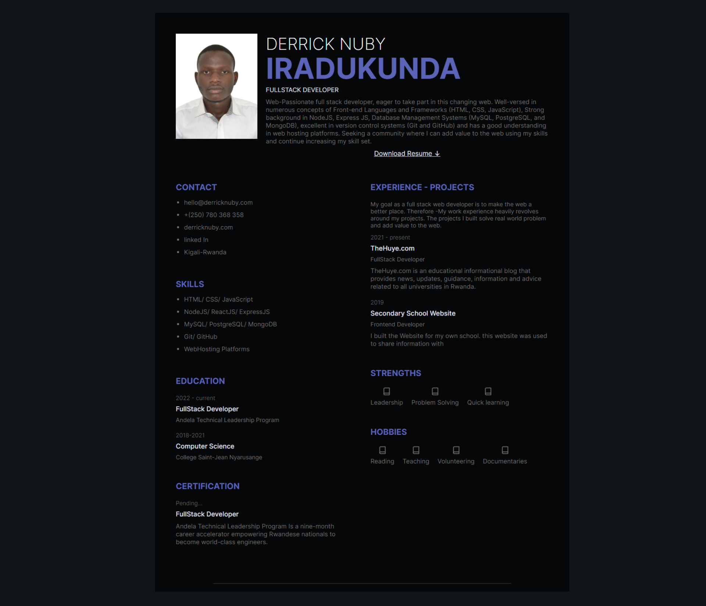
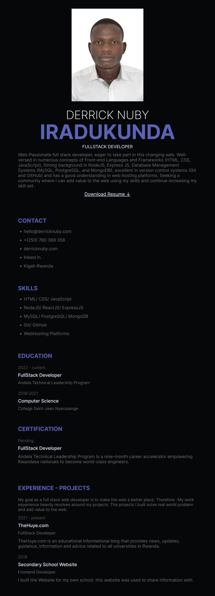

# MY CV/RESUME AS A DEVELOPER

## What is a cv/resume

A CV is a document that gives you a chance to show a prospective employer or collaborator the best of what you’ve got. It sells your skills, experience, and shows them you’re the right person for the job.

Particularly a **software engineering** resume showcases your ability to write code and develop software applications using computer engineering principles and various programming languages. As an experienced software engineer, it also shows your deep and diverse expertise in the field of software engineering science and your ability to provide technical direction and leadership to large software projects and engineering teams.

## Preview Image

## Why cv/resume

Your resume is your primary way, if not your only way, to connect with a tech recruiter and land a tech interview or coding interview at any company in the software industry.

## My cv

After analyzing the importance of a CV/ resume it is a roadblock to not have one. As they normally say.

**Getting your resume noticed by tech recruiters is the most crucial step to getting shortlisted for a tech interview.**

That is why I made my CV/Resume accessible to the public by designing it in plain HTML and CSS and hosted it on the web. Individuals may have a hard time downloading the pdf file and viewing it in mobile or a pad. The cv i designed is responsive and display well in all screen sizes available.

## Desktop View

## Mobile View

## Tech Stack

**Client:** HTML, CSS.

**Hosted:** GitHub Pages.

## Authors

- [@Derrick-Nuby](https://github.com/Derrick-Nuby)

## Features

- Responsiveness
- Dark Mode Only
- Cross platform

## Feedback

If you have any feedback, please reach out to us at iradukundaderrick@gmail.com
